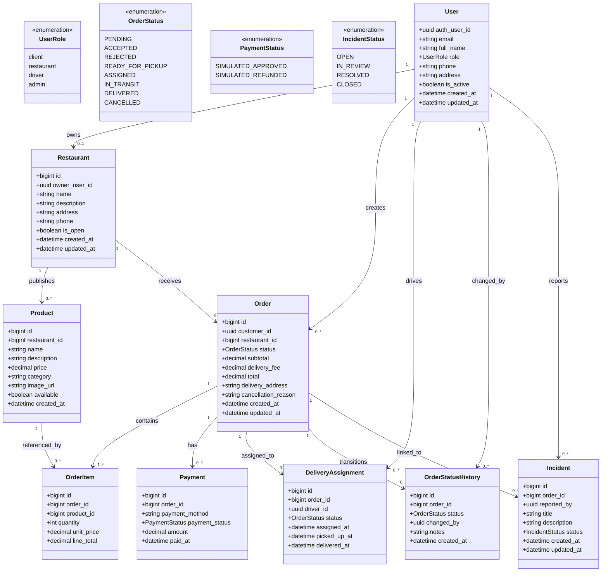

# SDD - 3.5.1 Logical View (propuesta final)

## 3.5.1 Logical View

La Vista Logica describe la estructura funcional del sistema de delivery a nivel de dominio, mostrando las entidades principales y sus relaciones para soportar autenticacion, catalogo, pedidos, entrega, pagos simulados e incidencias.

El sistema se organiza en los siguientes modulos de dominio:

- `Users`: gestiona perfil, rol y estado de cuenta para control RBAC.
- `Restaurants`: administra el comercio y su menu.
- `Orders`: gestiona carrito, checkout, items y ciclo de vida del pedido.
- `Deliveries`: administra la asignacion del repartidor y estados de entrega.
- `Payments`: registra transacciones simuladas y reembolsos simulados.
- `Incidents`: registra y da seguimiento a incidencias asociadas a pedidos.

### Reglas de negocio reflejadas en el modelo

- Un `User` puede ser `client`, `restaurant`, `driver` o `admin`.
- Un restaurante tiene un unico propietario (`owner_user_id`) y multiples productos.
- Un pedido pertenece a un cliente y a un restaurante.
- Un pedido contiene uno o mas `OrderItem`.
- Un pedido puede tener una sola asignacion de entrega activa (`DeliveryAssignment`) para cumplir BR-01.
- El flujo de estado del pedido sigue BR-02:
  `PENDING -> ACCEPTED/REJECTED -> READY_FOR_PICKUP -> ASSIGNED -> IN_TRANSIT -> DELIVERED` (o `CANCELLED` segun reglas).
- Los pagos son simulados (`SIMULATED_APPROVED`, `SIMULATED_REFUNDED`).
- Las incidencias se vinculan a un pedido y son reportadas por usuarios relacionados al pedido o por admin.

### Alineacion con alcance MVP actual

- Geolocalizacion en asignacion de repartidor se considera extension futura y no requisito obligatorio del MVP implementado.
- Integracion de pasarela de pago real queda fuera de alcance; el sistema usa pagos simulados.

## 3.5.1.1 Diagrama de Clases (UML)

## Nota de uso en el SDD

Este bloque puede insertarse directamente en la seccion `3.5.1 Logical View` del SDD. Si el formato final del documento requiere imagen UML en lugar de Mermaid, este mismo modelo puede exportarse a PlantUML o draw.io manteniendo identicas entidades y cardinalidades.
